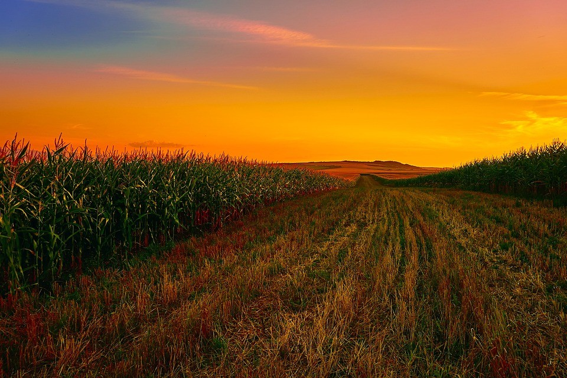
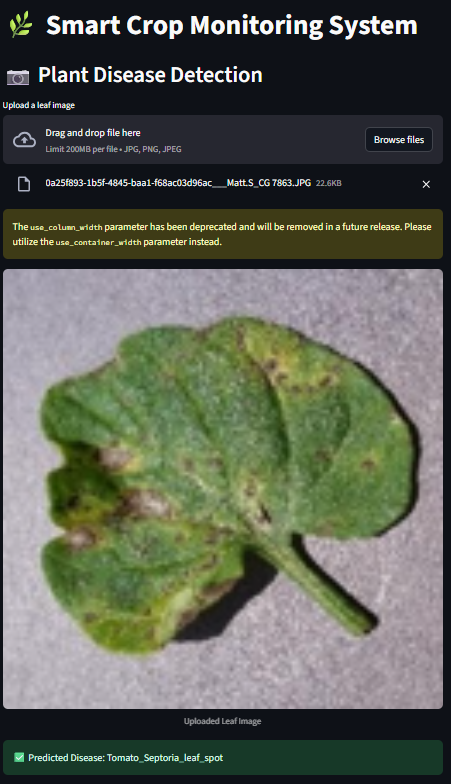
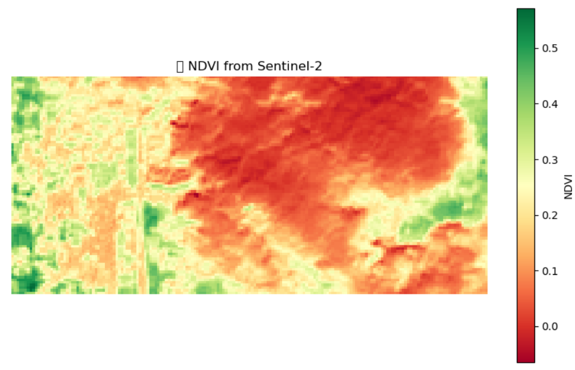

# 🌿 Smart Crop Monitoring Framework
<div align="center">
  
  <br/>
 
</div>

## 📌 Overview

This repository contains the implementation of **Regenerative AI for Sustainable Agriculture: A Smart Crop Monitoring Framework**, which integrates **Convolutional Neural Networks (CNN)** for plant disease detection and **NDVI (Normalized Difference Vegetation Index)** for field health analysis. The framework combines **IoT data, remote sensing, and edge/cloud AI deployment** to support precision agriculture and empower smallholder farmers.

---

## 🚀 Features

✅ Real-time plant disease detection using deep learning  
✅ NDVI heatmap generation from Sentinel-2 satellite bands  
✅ Streamlit web application for easy accessibility  
✅ Modular code structure with retraining notebooks  
✅ Compatible with edge devices for offline inference

---

## 🖥️ Demo

<div align="center">
  
  <br/>
  <i>Disease detection panel in the Streamlit app.</i>
</div>

<div align="center">
  
  <br/>
  <i>NDVI heatmap generated from Sentinel-2 Red and NIR bands.</i>
</div>

---

## 📂 Project Structure
```
smart-crop-monitoring/
├── README.md
├── LICENSE
├── requirements.txt
├── app.py
├── ndvi_tif.py
├── train_plant_disease_cnn.ipynb
├── plant_disease_cnn_model.h5
├── label_map.json
├── dataset_split_script.py
├── PlantVillage_Split/
│ ├── train/
│ └── val/
└── images/
├── architecture_diagram.png
├── ndvi_example.png
└── disease_detection_ui.png
```

- **app.py**: Streamlit application main script.  
- **ndvi_tif.py**: NDVI computation logic for GeoTIFF bands.  
- **train_plant_disease_cnn.ipynb**: Jupyter notebook to train CNN on PlantVillage dataset.  
- **plant_disease_cnn_model.h5**: Trained CNN model weights.  
- **label_map.json**: Class label mappings.  
- **dataset_split_script.py**: Script to split dataset into train and val folders.  
- **images/**: Screenshots and diagrams used in the project and documentation.

---

## 📦 Installation

1. **Clone the repository**

```bash
git clone https://github.com/yourusername/smart-crop-monitoring.git
cd smart-crop-monitoring
```

### 2. Create a virtual environment (recommended)

```bash
conda create -n cropapp python=3.9
conda activate cropapp
```

### 3. Install dependencies

```bash
pip install -r requirements.txt
```
### 4. Run the Streamlit app

```bash
streamlit run app.py
```

---

## 🔧 Dependencies

Key packages used:

- TensorFlow
- Streamlit
- NumPy
- Pillow
- Rasterio
- Matplotlib
- scikit-learn

📦 All packages are listed in requirements.txt

---

## 🗂️ Dataset

This project uses the [PlantVillage dataset](https://www.kaggle.com/datasets/emmarex/plantdisease) for training the plant disease classification model.

📌 The dataset is not included in this repository due to size.  
📁 After downloading, run the dataset_split_script.py to create train/val folders:

```bash
python dataset_split_script.py
```

For NDVI analysis, download Sentinel-2 bands (B04 - Red, B08 - NIR) from:

- [Copernicus Open Access Hub](https://scihub.copernicus.eu/)
- [Sentinel EO Browser](https://apps.sentinel-hub.com/eo-browser/)

---

## 🧠 How It Works

### 🩺 Plant Disease Detection

- Uses a lightweight CNN model trained on PlantVillage data.
- Class mappings are stored in label_map.json.
- The Streamlit app allows users to upload crop leaf images and returns predicted disease.

### 🛰️ NDVI Estimation

- Accepts Sentinel-2 Red and NIR band GeoTIFF images.
- Computes NDVI using the formula:

\[
NDVI = \frac{(NIR - Red)}{(NIR + Red)}
\]

- Visualizes NDVI as a heatmap for crop health monitoring.

---

## 🔬 Research Paper

This repository implements the methods proposed in:

📄 Regenerative AI for Sustainable Agriculture: A Smart Crop Monitoring Framework  
👤 Kirti Vardhan Singh  
🏫 Department of Computer Science and Engineering,  
Centurion University of Technology and Management, Bhubaneswar, India  

📝 Full paper and LaTeX source available upon request.

---

## 📈 Future Work

- Integration with LoRa-based IoT soil sensors  
- YOLOv8 weed detection module  
- Multi-language farmer app support  
- Edge deployment on Jetson Nano or Raspberry Pi  

---

## 🤝 License

This project is licensed under the MIT License. See [LICENSE](LICENSE) for details.

---

## 💡 Citation

If you use this work in your research, please cite:

```bibtex
@article{singh2025smartcrop,
  title={Regenerative AI for Sustainable Agriculture: A Smart Crop Monitoring Framework},
  author={Kirti Vardhan Singh},
  year={2025},
  institution={Centurion University of Technology and Management}
}
```

---

## 📧 Contact

Kirti Vardhan Singh  
📫 Email: kirtivardhan7549@gmail.com


─────────────────────────────

### 🔔 **Important Tips**
✅ Push **only minimal sample data** (e.g. 2-3 images per class) due to GitHub file size limits.  
✅ Add `.gitignore` for large datasets if you retain local folders.  
✅ Use meaningful commit messages (e.g. “Add CNN training notebook”, “Integrate NDVI module”).  
✅ Write a pinned issue or Discussion for future improvements if this is part of your portfolio.

─────────────────────────────

Let me know if you want me to **draft your README.md fully**, generate the requirements.txt content from your environment, or write sample commit messages to initiate your repo systematically today.


<div align="center">
  Built with ❤️ for sustainable agriculture.
</div>
```


